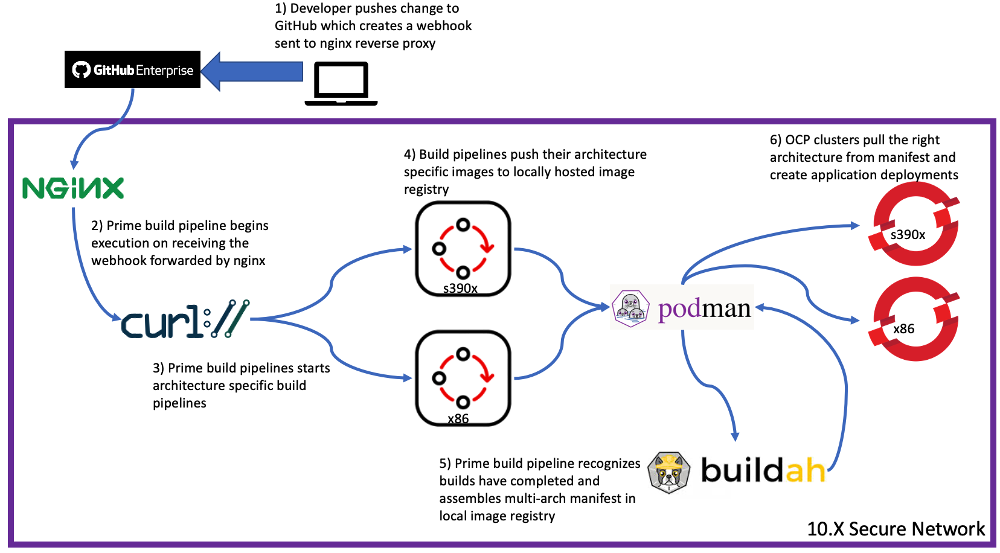
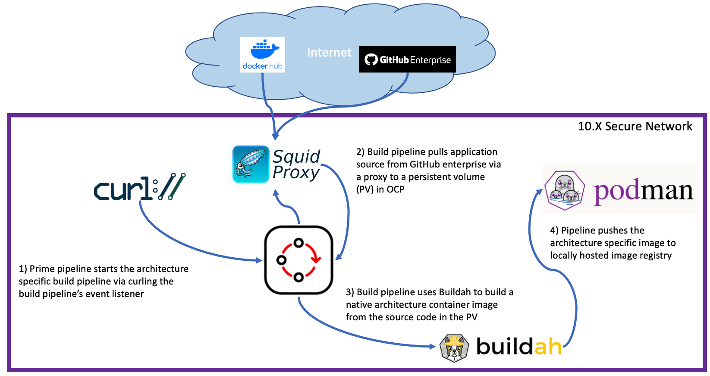

# ocp-pipelines
Repository for build and deployment pipelines. Acmeair and petstore have been configured to be built and deployed on x86 and s390x using multi-arch manifests. The general flow for each app is approximately the same, however, they each require some extra, unique configuration steps.
The motivation of this repository is the idea that build and test clusters should not be manually modified. Therefore, OCP pipelines have been created to propogate the changes made in this cluster to the build and test clusters. Also, all of this occurs inside a disconnected environment.

## petstore
Pipelines to build and deploy the petstore app available [here](https://github.ibm.com/LinuxCoC/petstore)
### build/build-pipeline
The files in this folder are the generic build pipeline files. Using the manager-pipeline automation on build0, these pipelines can be quickly deployed to build either s390x or x86 images.
### build/build-prime-pipeline
The pipeline in this folder manages the multi-arch builds. Once each architecture has been built, this pipeline creates a multi-arch manifest for deployment.
### deploy/deploy-pipeline
This pipeline works with the build pipelines to be able to deploy petstore. It relies on some custom resources created by the build pipeline since those resources rely on the application source. The idea is that the clusters an app is deployed on will probably be disconnected.

## acmeaircard
Pipelines to build and deploy the acmeaircard app available [here](https://github.ibm.com/LinuxCoC/Acme-Air-3.0)

## Adding a new application
Create a new directory in the root of this repo. The name of the directory will be the deployment namespace. Then create build and deploy pipelines and directories following the resources in `shared-pipeline-resource/template`. Once you are ready to test, push the changes to GH and make sure the build and deploy pipelines are correctly created on build0, test0 and xocp1. 

## Functional ID Access
To authenticate with other clusters a functional ID is used. The credentials for the functional ID are stored in IBM Cloud Secrets Manager, and the external secrets operator is used to get the creds into an OCP secret (funkid-creds). To notify the external secrets operator to add the secret to a given namespace add this label `secret-store: build0-secrets-manager` to the namespace. 
Also, on each new cluster that the functional ID must access, use `oc apply -f shared-pipeline-resources/funkid-config` to create a group and the clusterrolebindings to permit the ID to list tasks and pipelineruns. Alternatively, add `hcitfunkid` to the admins group if it needs to create/manage OCP resources.
